## Deconstructing master artists
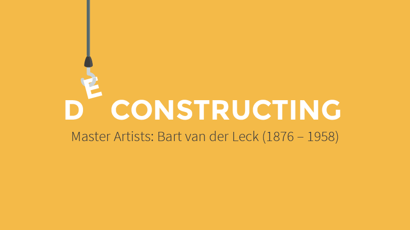

This project discusses Bart van der Lecks painting »composition no. 7 (mountain view)« in the areas of artistic categorisation, biographical background, art-historian image analysis and their application to generative design, which means in this case simple data visualization.

### The assignment
The initial task was to choose a designer or artist and analyze a single piece of art or a whole series from his/her oeuvre in detail. After familiarizing with the individual language of forms and the used laws of gestalt the assignment requested us to develop individual methodologies and tools to understand the underlying system and construction the artist used for his work. The knowledge obtained through this process should then be applied to reproduce or develop his/her work further.

The assignment »Deconstructing master artists« was part of the course »Designing with code – the basic of generative design« held by Fabian Morón Zirfas at the University of Applied Sciences Potsdam.

### Bart van der Leck: Dutch painter and founding member of De Stijl
This chapter focuses on biographical details from Bart van der Lecks and his artistic development during his career in arts.

#### Life and career
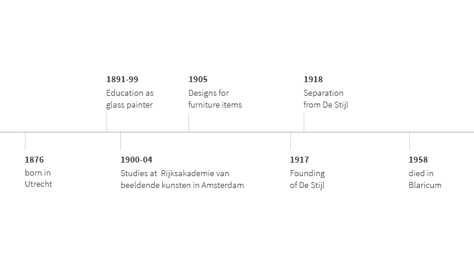  
Bart Anthony van der Leck, born in the dutch city of Utrecht on the 26th of November 1876, developed great interest in painting stained glass in his early years which led him to attend education as a glass painter from 1891 to 1899 in his hometown at the so called »Rijksschool voor Kunstnijheid«. He also worked several years as a craftsman in this field until he started his studies at the »Rijksakademie van beeldende kunsten« in Amsterdam in 1900, where he stayed until 1904. Later on he designed several items of furniture like carpets, tableware and sofas. After working several years as an artist he founded the artist group »De Stijl« together with Theo van Doesburg, Robert van't Hoff, Jan Wils, Vilmos Huszár, Antony Kok, Bob Oud and the famous Piet Mondrian. No more than one year later he separated from the group to follow his own artistic paths without being restricted the groups ideas and policies on art. Looking back on a productive life as an artist he died on the 14th of November in the city of Blaricum.

#### De Stijl
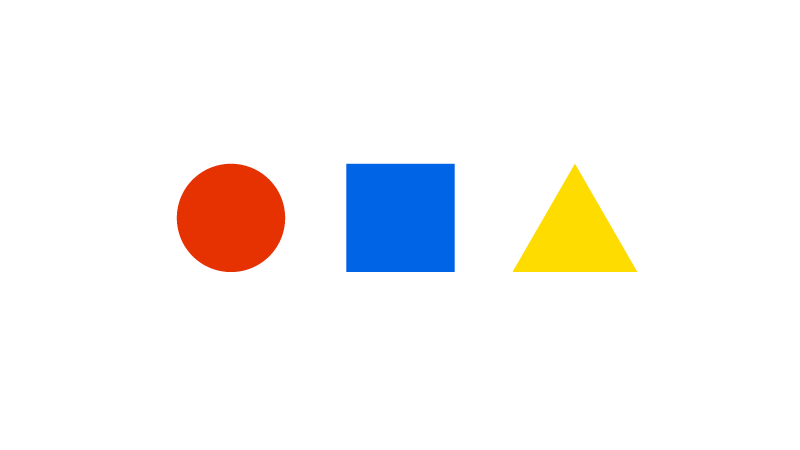  
Our intention is not to cover the whole artistic movement behind and around De Stijl but rather giving a quick overview for interested readers to make the following chapters easier to understand even without deep knowledge of art history. So just a quick word on De Stijl:
De Stijl artists pursued an aesthetic of abstract yet geometric forms and color simplicity. The resulting functional art only uses primary colors plus white, black and the grey scales in between. The central design principles are tidiness and clarity. Natural organic forms and ornaments were scorned instead their intention was to create a new kind of art with high formal aesthetics requirements.

#### Work and oeuvre  
While Bart van der Lecks early pieces of art around 1895 were shaped by his work as a glass painter he developed a more impressionistic character in his oeuvre during his university education in early 1900. Which finally lead to a transition to stylized forms and expansive application of color first seen in a painting from 1912. This transition continued until 1916 when Bart van der Leck reduced his color range to primary colors and reached its completion with the founding of De Stijl in 1917. From now on Bart van der Leck uniquely and exclusively used this newly developed language of forms.   

### Analysis
#### Composition No. 7 - Berglandschaft (mountain view)
For the second part of our assignment we agreed to focus on Bart van der Lecks late De Stijl period, to be precise the time shortly before he leaves the artistic group. We chose one of his travel paintings form 1917 which he called »composition no. 7 (mountain view)«. This painting was part of a larger series Bart van der Leck produced during his journey across Algeria. Its current value lies within 367.740 € at this time.  

>[»Dutch Constructivism«](https://www.flickr.com/photos/100739735@N06/16337581301/in/photolist-qTGnJe-ymmvWS-ob7ofP-d9R2Jd-pTKJZJ-oWQdNJ-5aa5DB-98QJby-cQ9edJ-HRJFz6-bcsNdt-z1Lnoj-5pQXWG-pBhri9-o1TVFG-q41vY-29FG9-oWT6U6-o4JLrY-oWQbF7-pBfpiD-dfMwBu-ppuKkv-o1TP9U-ppLTse-pTrJxM-pBerKf-ppvUx9-oWQdBm-dFtmhY-pBbVWc-p8hFYC-pBbXSr-iaZSu7-p8hHPm-5pQWRA-dFtkW3-dqd19i-bM6AKk-7741J8-pBhjqm-oWQ99J-ppLSxt-f9Wu5Z-o1Hxnn-jJBjtc-523MRh-pBhiG7-euzKXY-fabJk7) by [Maryellen McFadden](https://www.flickr.com/photos/20745656@N00/), licensed under [CC BY-NC-ND 4.0](https://creativecommons.org/licenses/by-nc-nd/4.0/)

The difficulties in analyzing an abstract painting should not be underestimated, so in order to analyze this piece of art properly we went from the more obvious to the complex parts:

#### Primary colors
Typically for an artist shaped by the De Stijl movement we only find primary colors and black in »composition no. 7«. If you want to view the painting as a whole and include the canvas as well you could also add white to the list of colors.  
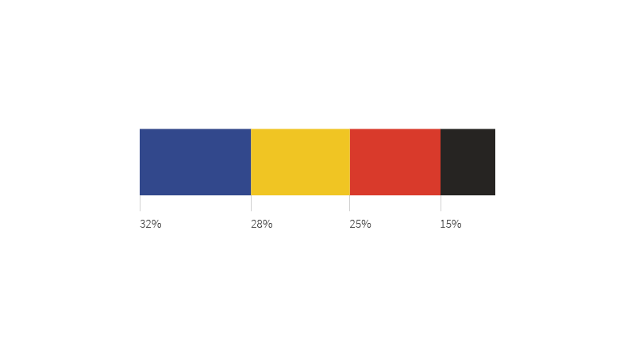  
If we look at the percentage distribution, we notice that blue is the most dominant color with 32%, followed by yellow and red in nearly equal amounts (28% and 25%), while black is in the bottom position with only 15%.

#### Basic shape: orientation, size and proportions
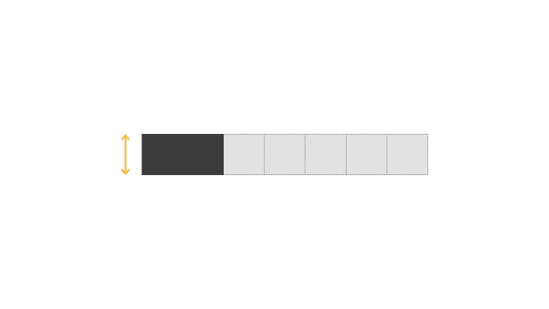

The basic shape is a rectangle with horizontal orientation. The different sizes are multiples from a underlying square shape, whereby the duplication of that shape defines the smallest unit. The biggest found unit matches the sevenfold of this square unit.  
  
The percentage distribution reveals that middle-sized shapes are the commonest, while extremely small or huge shapes make only 7% each. The large majority this summed up 44% are consist of fourfold or fivefold of the basic square shape.  
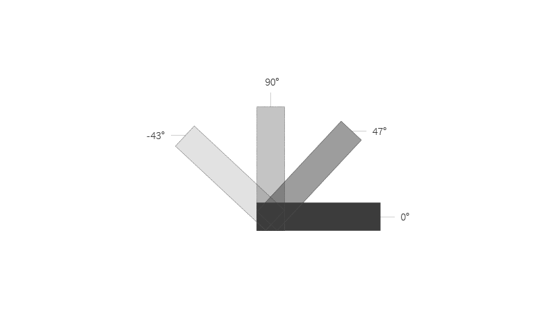  
The orientation puzzled us: Besides the easily recognisable 0° and 90° angles there were lots of similar yet not identically angles around 45° which means: 43°, 46° and 47°. Also 133°, 131° and 132° angles were found. At this point of the project we assumed it was a measurement inaccuracy due the the digital reproduction of the painting.  
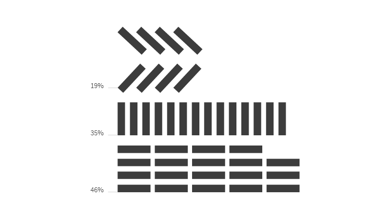  
We did not attribute a big importance to this discovery because it revealed that the rotated shapes only make up to 19% of the painting while shapes with clear angles (0° or 90°) provide 81% in total.

#### Laws of Gestalt
We also analyzed »composition no. 7« in relation to the laws of Gestalt and their categories. We came up with the following result which we will describe in detail later on:

* **Law of Regularity** in the categories of form and repeat
* **Law of Similarity** in the categories of color, form and repeat
* **Law of Proximity** in the category of form

##### Law of Regularity  
The law of regularity says that if neighbouring objects exhibit repeating patterns, human perception perceives them as a group.

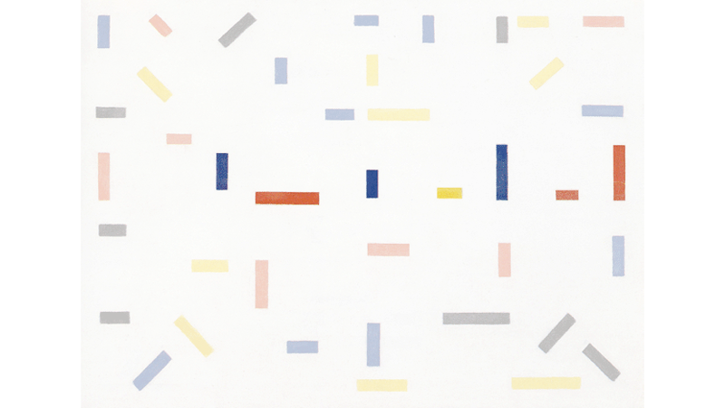
>[»Dutch Constructivism«](https://www.flickr.com/photos/100739735@N06/16337581301/in/photolist-qTGnJe-ymmvWS-ob7ofP-d9R2Jd-pTKJZJ-oWQdNJ-5aa5DB-98QJby-cQ9edJ-HRJFz6-bcsNdt-z1Lnoj-5pQXWG-pBhri9-o1TVFG-q41vY-29FG9-oWT6U6-o4JLrY-oWQbF7-pBfpiD-dfMwBu-ppuKkv-o1TP9U-ppLTse-pTrJxM-pBerKf-ppvUx9-oWQdBm-dFtmhY-pBbVWc-p8hFYC-pBbXSr-iaZSu7-p8hHPm-5pQWRA-dFtkW3-dqd19i-bM6AKk-7741J8-pBhjqm-oWQ99J-ppLSxt-f9Wu5Z-o1Hxnn-jJBjtc-523MRh-pBhiG7-euzKXY-fabJk7) by [Maryellen McFadden](https://www.flickr.com/photos/20745656@N00/), licensed under [CC BY-NC-ND 4.0](https://creativecommons.org/licenses/by-nc-nd/4.0/) / Highlighting individual objects

##### Law of Similarity
The law of similarity says that human perception perceives identical objects as unit.

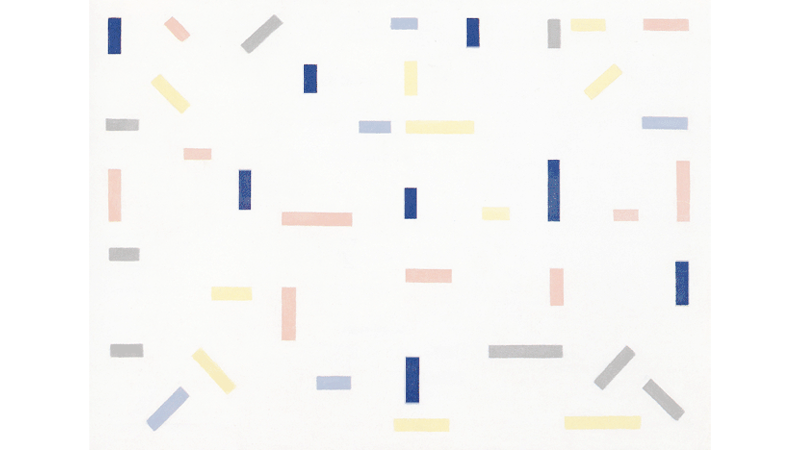
>[»Dutch Constructivism«](https://www.flickr.com/photos/100739735@N06/16337581301/in/photolist-qTGnJe-ymmvWS-ob7ofP-d9R2Jd-pTKJZJ-oWQdNJ-5aa5DB-98QJby-cQ9edJ-HRJFz6-bcsNdt-z1Lnoj-5pQXWG-pBhri9-o1TVFG-q41vY-29FG9-oWT6U6-o4JLrY-oWQbF7-pBfpiD-dfMwBu-ppuKkv-o1TP9U-ppLTse-pTrJxM-pBerKf-ppvUx9-oWQdBm-dFtmhY-pBbVWc-p8hFYC-pBbXSr-iaZSu7-p8hHPm-5pQWRA-dFtkW3-dqd19i-bM6AKk-7741J8-pBhjqm-oWQ99J-ppLSxt-f9Wu5Z-o1Hxnn-jJBjtc-523MRh-pBhiG7-euzKXY-fabJk7) by [Maryellen McFadden](https://www.flickr.com/photos/20745656@N00/), licensed under [CC BY-NC-ND 4.0](https://creativecommons.org/licenses/by-nc-nd/4.0/) / Highlighting individual objects

##### Law of Proximity
The law of proximity says that if objects exhibit physical proximity, human perception perceives them as a group.

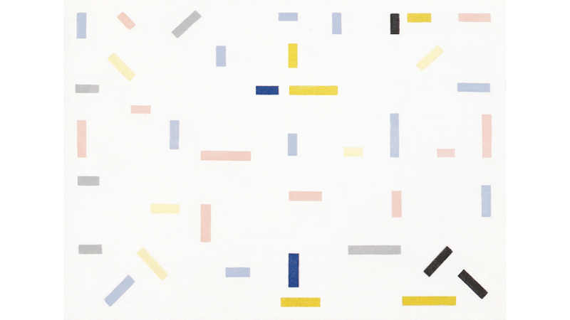
>[»Dutch Constructivism«](https://www.flickr.com/photos/100739735@N06/16337581301/in/photolist-qTGnJe-ymmvWS-ob7ofP-d9R2Jd-pTKJZJ-oWQdNJ-5aa5DB-98QJby-cQ9edJ-HRJFz6-bcsNdt-z1Lnoj-5pQXWG-pBhri9-o1TVFG-q41vY-29FG9-oWT6U6-o4JLrY-oWQbF7-pBfpiD-dfMwBu-ppuKkv-o1TP9U-ppLTse-pTrJxM-pBerKf-ppvUx9-oWQdBm-dFtmhY-pBbVWc-p8hFYC-pBbXSr-iaZSu7-p8hHPm-5pQWRA-dFtkW3-dqd19i-bM6AKk-7741J8-pBhjqm-oWQ99J-ppLSxt-f9Wu5Z-o1Hxnn-jJBjtc-523MRh-pBhiG7-euzKXY-fabJk7) by [Maryellen McFadden](https://www.flickr.com/photos/20745656@N00/), licensed under [CC BY-NC-ND 4.0](https://creativecommons.org/licenses/by-nc-nd/4.0/) / Highlighting individual objects

#### The missing grid
Due to the geometrical and clear appearance of »composition no. 7« we assumed that a complex underlying grid creates this minimalistic expression.

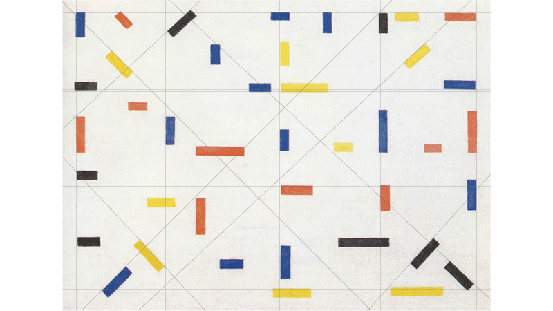
>[»Dutch Constructivism«](https://www.flickr.com/photos/100739735@N06/16337581301/in/photolist-qTGnJe-ymmvWS-ob7ofP-d9R2Jd-pTKJZJ-oWQdNJ-5aa5DB-98QJby-cQ9edJ-HRJFz6-bcsNdt-z1Lnoj-5pQXWG-pBhri9-o1TVFG-q41vY-29FG9-oWT6U6-o4JLrY-oWQbF7-pBfpiD-dfMwBu-ppuKkv-o1TP9U-ppLTse-pTrJxM-pBerKf-ppvUx9-oWQdBm-dFtmhY-pBbVWc-p8hFYC-pBbXSr-iaZSu7-p8hHPm-5pQWRA-dFtkW3-dqd19i-bM6AKk-7741J8-pBhjqm-oWQ99J-ppLSxt-f9Wu5Z-o1Hxnn-jJBjtc-523MRh-pBhiG7-euzKXY-fabJk7) by [Maryellen McFadden](https://www.flickr.com/photos/20745656@N00/), licensed under [CC BY-NC-ND 4.0](https://creativecommons.org/licenses/by-nc-nd/4.0/) / Highlighting construction

So we started to examine different possible constructions based on proportions. An initial evaluation indicated that:

* Right and left margin is not equal
* Vertical partition is not in equal quarters
* No consistent angles
* Separate elements do not form a line (one always deviates)
* Canvas is not split in uniformly segments by diagonal oriented objects
* No grid based on the smallest square shape oder its multiples

What was wrong? Was there no grid or were we just not able to find it?

We came to the following conclusion: What looks like a geometrically constructed grid is actually a purely optical construction.

### Replica
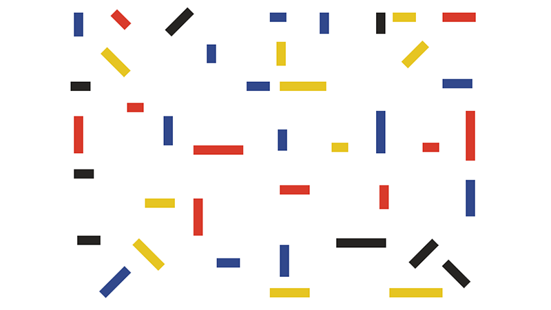

As we did not find any grid or construction behind the painting, we could just measure the coordinates and hardcode the whole piece. Our hope was that we might notice any kind of »number magic« if we view the separate components of the painting from a more numerical view. To make it short: There was no magic and we did not see anything besides colored rectangles.

### Further research
For a short period we thought about subsequently »geometrizing« the painting, so that we could define rules and develop a »Van der Leck generator«. But we quickly gave up on this idea because correcting an artists work would be disrespectful and also was not our intention (neither was it the assignments intention we believe). So instead we worked on a deeper understanding of Bart van der Lecks oeuvre, his approach and the special intention and context around and behind this painting.

Fortuanetly we found out a lot about Bart van der Lecks approach by reading Emil Kiesers »Analysen von Bildern und Plastiken der Moderne« (Analysis of paintings and sculptures of Modernity) where he mentions Bart van der Leck on page 64 with the following words:

»[...] however [Bart van der Lecks work] misses orientation in solder and balance and therefore the expression of truthfulness which radiates from Mondrians oeuvre. Van der Lecks arrangements appear random, non-binding and scattered at second glance. **It is rather an abstraction of a naturalistic representation** [...]«

These harsh words were our eureka moment! It also shed light on some of our unanswered questions (Why did Bart van der Leck separate from De Stijl, why is there no grid in such a geometric work, etc.). We finally had a point to start from: Abstracting a commonly known naturalistic representation!

But we were not fully satisfied yet. This last part of the assignment needed to be executed in code and as simple it is to get your hands on a photo and build an abstract version of the motive with Bart van der Lecks repertoire of forms as hard it gets if you want to teach an algorithm to do this. You need to dig deep into computer vision and this project was neither the time nor the place to do so – but we came up with something different while we thought about artistic data visualization which we have seen in Julia Laubs work (we studied her portfolio intensively for an other part of this course).

### Mountain view: Visualizing data with Bart van der Lecks language of forms
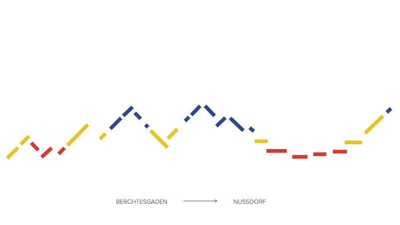  
In spirit of Bart van der Lecks oeuvre we have created abstracted mountain views which are actually simple data visualizations based on the altitude profile a hiker completed.

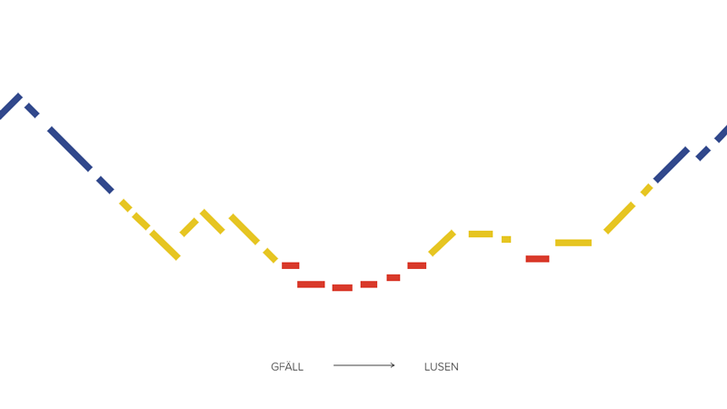  
Thanks to Anna, a fellow hiker, for providing her mountain tour data!

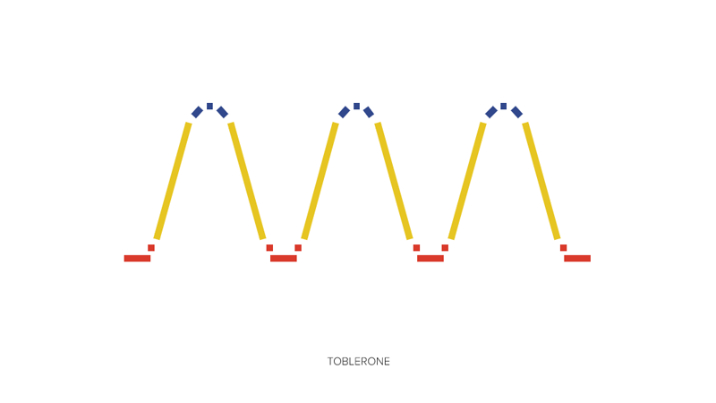  
We also created an altitude profile for our favorite swiss mountain range.

#### Data basis
If you go hiking on a regular basis and also like advanced tours most hikers use online tools to get a profile of difference in altitude for their chosen tour. The reasons behind this are quite easy to understand: Imagine to walk 5 km on a straight and flat street, now imagine to walk the same distance on a mountainous, winding terrain. You might as well come to the conclusion that the same distance is much more exhausting in the second example. So you need a altitude diagram to schedule your tour, evaluate the level of difficulty for the tour you have chosen and compare the challenge to your own physical resilience to guarantee your safety.

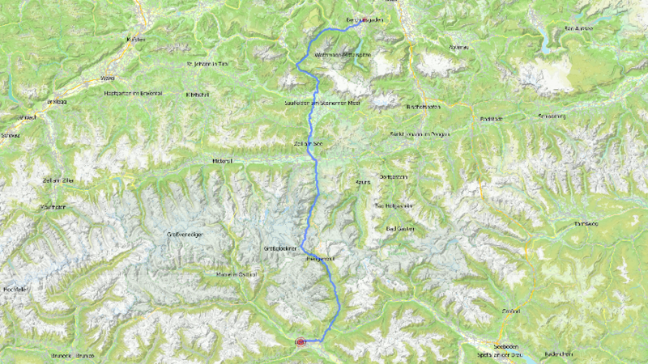

Anna gave us the startingpoint and endpoint for a few mountain tours she recently made and we used them to generate altitude diagrams. At the start we were sure to generate a data basis from the online tools we used which comes in form of a .csv file or something similar. But actually this seems to be quite unusual and instead we got diagrams and graphics with detailed scales. After several tries we found out that the best method is to measure out significant landmarks. So we got a x-value which gives us the altitude and a y-value which gives us the distance. The so gained data was then used as the base for the visualization: The coordinate pairs we gained this way defined the starting point, the endpoint and the angle of one rectangle to visualize a road section.

#### Map legend: How to read the diagram
Although color coding is controversial discussed in the design community, we wanted to make best use of the language of forms and colors given to us by Bart van der Leck. With rising altitude temperature and vegetation change: Once you cross the timber line the dense pine forests disappear and the climate gets rougher and colder. We visualize this changing conditions and landscape with a simple color model made from the primary colors: The color blue is used to describe mountain peaks while yellow and red mark lower altitude levels whereby the color red characterizes mountain valleys.

#### Taking a look at code
If you want to take a closer look at how this was done you can find the code [here](./data/p5js/mountain-view/).

---------------------------------------

### License (MIT)

(c) 2017 Edmundo Mejia Galindo, Julia Hilt, University of Applied Sciences Potsdam (Germany)

Permission is hereby granted, free of charge, to any person obtaining a copy of this software and associated documentation files (the "Software"), to deal in the Software without restriction, including without limitation the rights to use, copy, modify, merge, publish, distribute, sublicense, and/or sell copies of the Software, and to permit persons to whom the Software is furnished to do so, subject to the following conditions:
The above copyright notice and this permission notice shall be included in all copies or substantial portions of the Software.
THE SOFTWARE IS PROVIDED "AS IS", WITHOUT WARRANTY OF ANY KIND, EXPRESS OR IMPLIED, INCLUDING BUT NOT LIMITED TO THE WARRANTIES OF MERCHANTABILITY, FITNESS FOR A PARTICULAR PURPOSE AND NONINFRINGEMENT. IN NO EVENT SHALL THE AUTHORS OR COPYRIGHT HOLDERS BE LIABLE FOR ANY CLAIM, DAMAGES OR OTHER LIABILITY, WHETHER IN AN ACTION OF CONTRACT, TORT OR OTHERWISE, ARISING FROM, OUT OF OR IN CONNECTION WITH THE SOFTWARE OR THE USE OR OTHER DEALINGS IN THE SOFTWARE.

See also http://www.opensource.org/licenses/mit-license.php
