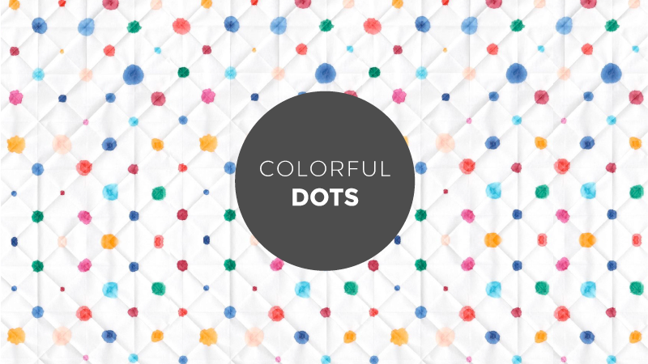
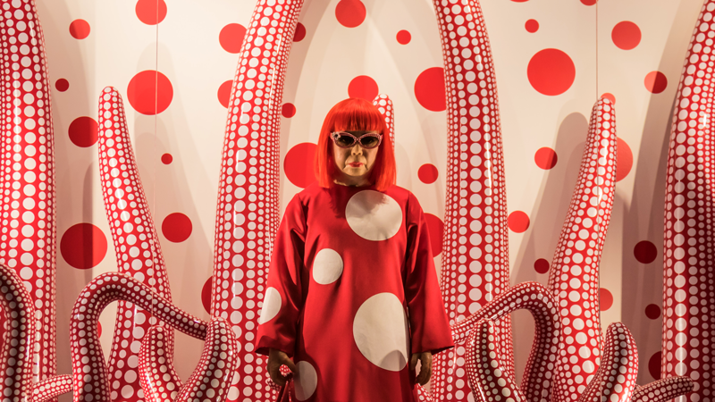
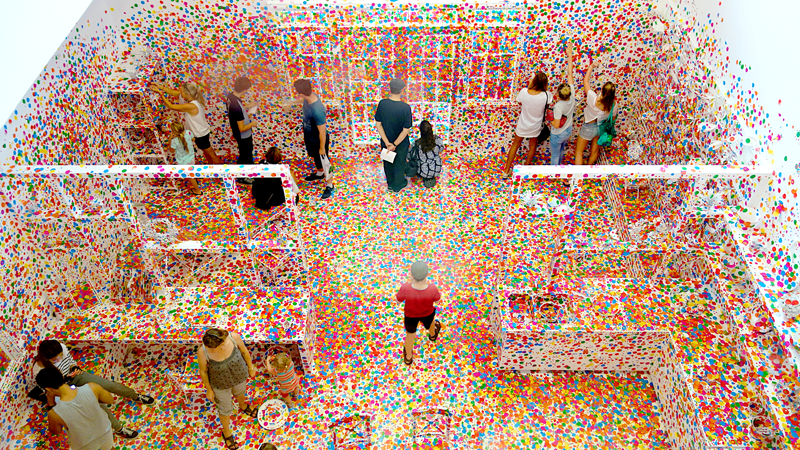
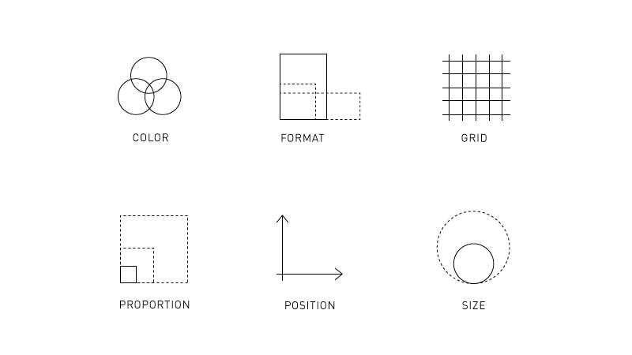
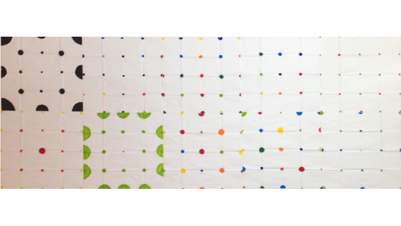
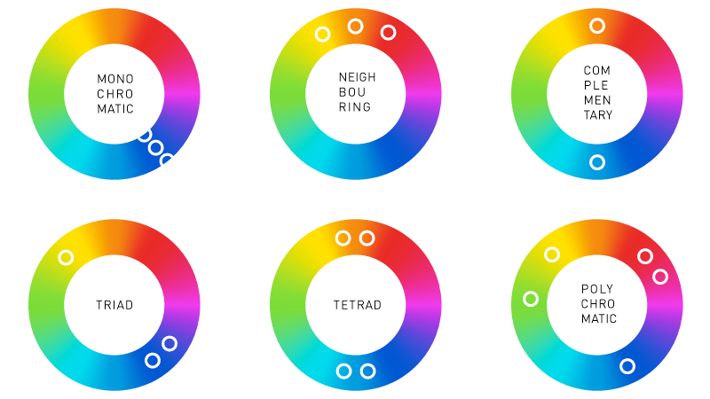
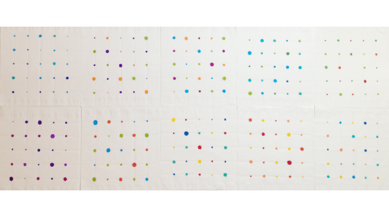
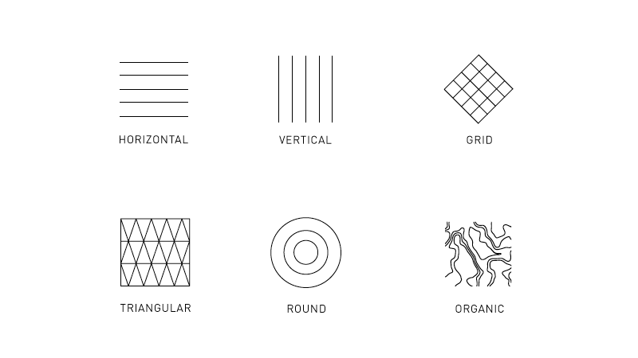
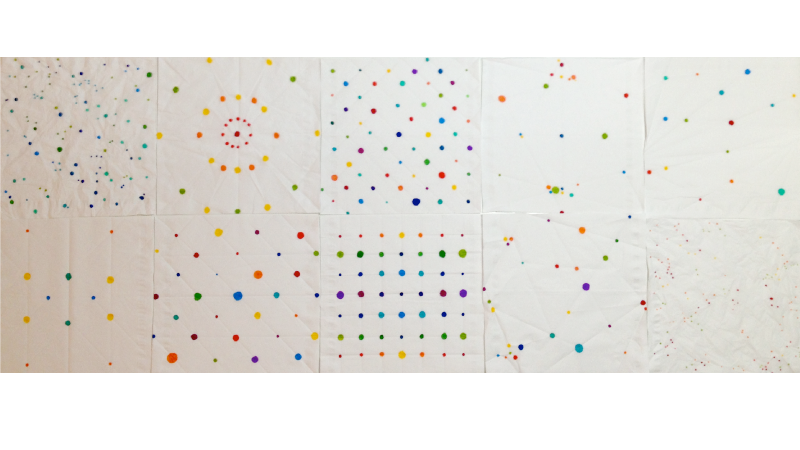
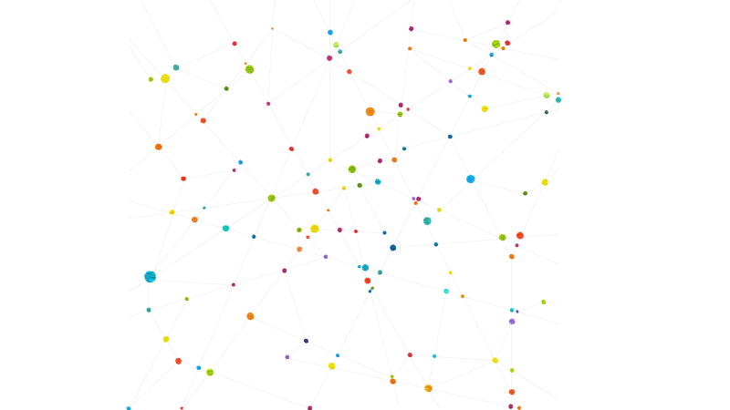

# Colorful Dots

This project shows an analog algorithm using human playfulness, colorful dots and grids. The process of improvement and further development can be traced through various iterations.

## The assignment
The initial assignment was to sketch a simple analog algorithm and find 10 humans to execute it. The drawing instructions should define format, tools, material and painting surface. Additional conditions were to keep the instructions short, understandable, easy to execute and provide a framework while also leaving room for interpretation. Later on up to three iterations with different settings in form of alternating persons, a change in material or surface or adjustments on the algorithm itself were requested. The insights of this process should then be used to spell out parameters, variables and constants of your algorithm to gain a better understanding of the functional principle of algorithms in general as a preparation for later following code lessons.

The assignment »Analog algorithm« was part of the course »Designing with code – the basic of generative design« held by Fabian Morón Zirfas at the University of Applied Sciences Potsdam.

## Inspiration: Yayoi Kusama

This project was inspired by the undisputable queen of dots: Yayoi Kusama. Her whole oeuvre is characterized by dots in every size, color, shape and medium from dots on horses, trees and pumpkins to classical polka dots and dot based patterns. Yayoi Kusamas lifelong obsession with dots is closely related to her metal illness which includes hallucinations of dots and net structures and her deep fear to vanish into dots herself.

In 2012 the Japanese artist provided a completely white room as blank canvas for the visitors of Queensland Gallery of Modern Art. Every visitor received colorful adhesive dots in various size and was encouraged to leave a trace behind by sticking a dot somewhere in the room. After several weeks a look in the so called »obliteration room« shows what it looks like when hundreds of visitors let their human playfulness run free.

## Drawing instructions
The first version of my analog algorithm contained four steps consisting of one sentence each. I tried to phrase my instructions as clear and short as possible to minimize potential misunderstandings. The instructions are as follows:

  »**Take** a paper tissue and unfold it. You are now able to see the folded grid.  
  **Use** the provided felt-tip pens and draw dots at the intersection points of the grid.  
  **Vary** the dot size through changing the period of time you press the felt-tip pen on paper.  
  **Repeat** step two and three until all intersection points are highlighted in different colors.«

## Tools, material & format
Tools and materials were chosen for the instructions needs and also with an eye on my student budget. Ten paper tissues served as drawing canvas for a 10 felt-tip pens in several colors like you usually find them in stationary shops. Due to the specified size of the paper tissues the format was around 20 x 20 cm.

## Parameters, variables & constants
  
The given parameters in this algorithm were color, format, grid, proportion, position and size. While format, grid and position are constants, color, size and proportion are variables. To explore how the results develop further by changing the parameters I would chose a constant and a variable to adapt them.

## First iteration
Fortunately my first attempt worked out well and 10/10 executing humans understood what to do. The biggest factor of uncertainty was the question whether or not the drawing instructions would trigger the examinees playfulness. In order to find out which examinees are most suitable for my intention I worked with several groups of persons: 10 year old children, students in their mid twenties, middle aged scientists, people working in the creative industry, financial controller and also medical staff. My goal was to bring together as many different problem solving approaches as possible from analytic to intuitive, systematic and methodically to spontaneous and from consciously thinking a problem through like a adult to the carefree approach of a child.

It's fascinating how the execution is characterized by the examinees personality. While some create very even patterns with similar sized dots and a self-imposed restriction in color, others tend to use a great set of colors to create intuitive compositions.

## Second iteration
As announced in the chapter »parameters, variables & constants« the second iteration was used to explore changing parameters. After looking at the ten results from the first iteration and comparing them with the given parameters it seemed most promising to me to concentrate on color (variable) and grid (constant).

### Color spectrum
To explain the thought behind this variation we have to dig a little deeper into color theory: There are several forms of color contrasts with different visual effects. If you think of a color wheel the composition is strongly influenced by the position of the single color on this circle. I had to keep in mind that my depth in color was limited due to the rather bright colors of the felt-tip pens. I chose to work with monochromatic, polychromatic, neighbouring and complementary colors as well as triads and tetrads of color.

Neighbouring colors are characterized by their close symmetrical position and similar distance to each other on the color wheel. This color contrast is known as harmonious but can also easily look boring. Monochromatic colors are one color shade in different levels of brightness based on the darkest shade and create a color graduation. Complementary colors are situated on the opposite of the color wheel which results in a very high contrast. These colors normally appear as pairs (blue and orange, green and red, etc). A triad of color is constructed from three colors. In addition to the first color two neighbouring colors are chosen on the opposite of the color wheel. Similar to a triad a tetrad is build from two pairs of neighbouring colors which are opposite to each other on the color wheel. Last but not least polychromatic colors are a combination of several freely chosen colors.

  
The second, color based iteration brought interesting results. To make it easier for the examinees I presorted the felt-tip pens. Due to the more complex drawing instructions the examinees became more cautious and less playful which leads to quite homogeneous results but a harmonious overall look.

### Grid
The second variation changed the visual base of the algorithm. A grid can come in different shapes and will radically change the results appearance.

  
After a little research I defined six characteristics for the grid: Horizontal, vertical, diagonal, triangular, round and organic. While geometrically constructed grids are normally man-made, organic patterns are mostly inspired by nature.  
The most difficult part was to create the grids on my chosen material. After several experiments with other absorbent papers (like kitchen roll, paper tissues, paper napkins, kleenex, tissue paper) make-up removal tissues appeared to be the most suitable material. But due to their storage in a box they were folded which means there were already grid lines. So my main question was: How to get rid of those lines and receive a flat surface? Finally I came up with an old trick tailors use for very sensitive fabrics like chiffon or silk: To iron wrinkles out tailors lay a layer of sturdy fabric between flat iron and chiffon. So I got myself a kitchen towel and started to iron all tissues needed. After that and an hour of origami later I finally had the grids I wanted.

  
Changing this parameter gave the most promising results! The strategy of changing a constant instead of a variable has proved to be successful because the examinees don't feel limited by to many rules and the single dots get a relation to each other by the nearly invisible white on white grid.

## Third iteration  

The third and final iteration derives from the sum on experience of earlier versions. That means I use a polychromatic set of colors from which my examinees are free to choose and a line based grid that creates various polygons. Inspired by [Aaron Koblins 10.000 cents project](http://www.aaronkoblin.com/project/10000-cents/) my intention was to let my examinees create a bigger artwork without knowing by executing the same analog algorithm.

### Grid and format  
  
First of all the procedure described on the »grid« chapter had to be repeated which meant lots of ironing and advanced origami. To form a complete, cohesive picture at the end the single paper tissues had to align seamlessly. This fact in mind I started to construct the overall picture and then sliced it in nine parts which I later applied to the paper tissues by folding them accordingly.

### Final drawing algorithm
»The random distribution of lines results in a **grid** in which every intersection point is marked with a dot.  
Their **size** behaves proportional and random to the time factor with which ink takes effect on the paper.  
The **color** of the dots comprises of any primary and secondary color of the additive color mixing.«

---------------------------------------

## License (MIT)

(c) 2017 Julia Hilt, University of Applied Sciences Potsdam (Germany)

Permission is hereby granted, free of charge, to any person obtaining a copy of this software and associated documentation files (the "Software"), to deal in the Software without restriction, including without limitation the rights to use, copy, modify, merge, publish, distribute, sublicense, and/or sell copies of the Software, and to permit persons to whom the Software is furnished to do so, subject to the following conditions:
The above copyright notice and this permission notice shall be included in all copies or substantial portions of the Software.
THE SOFTWARE IS PROVIDED "AS IS", WITHOUT WARRANTY OF ANY KIND, EXPRESS OR IMPLIED, INCLUDING BUT NOT LIMITED TO THE WARRANTIES OF MERCHANTABILITY, FITNESS FOR A PARTICULAR PURPOSE AND NONINFRINGEMENT. IN NO EVENT SHALL THE AUTHORS OR COPYRIGHT HOLDERS BE LIABLE FOR ANY CLAIM, DAMAGES OR OTHER LIABILITY, WHETHER IN AN ACTION OF CONTRACT, TORT OR OTHERWISE, ARISING FROM, OUT OF OR IN CONNECTION WITH THE SOFTWARE OR THE USE OR OTHER DEALINGS IN THE SOFTWARE.

See also http://www.opensource.org/licenses/mit-license.php
