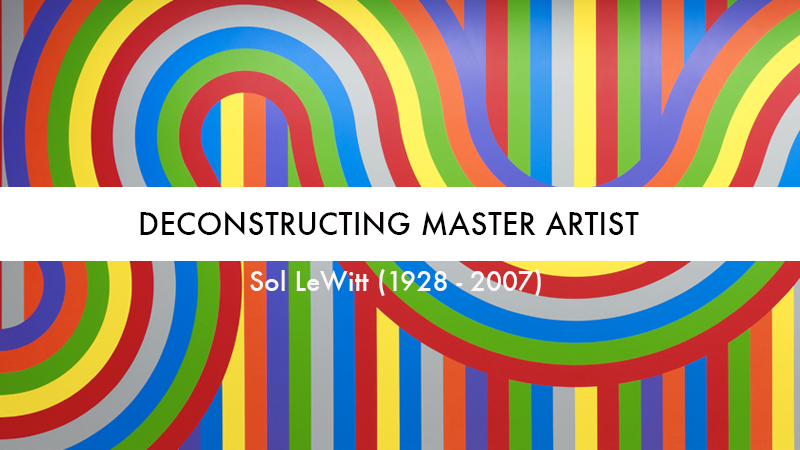

--- 
authors: 
  - "Daniele Maselli"
  - "Denys Ivanchenko"
authors-url: 
  - "https://github.com/DanieleMaselli"
  - "https://github.com/deivanchenko"
layout: project
title: "Sol Lewitt - Geometric shapes"  
type: project
---

## Deconstructing Master Artist: Sol Lewitt 

The following project shows the result of the seminar project "deconstructing master artist" at the university of applied science in Potsdam supervised by Fabian Morón Zirfas. The course provides an introduction of basic programming in P5.js and Processing with a focus on gestalt psychology and a workshop on physical computing.

 
## About Sol LeWitt

Born in 1928 in the city of Hartford (USA, Connecticut), the son of Jewish immigrants from Russia.
From 1945 to 1949 he studied art history at Syracuse University, after graduation traveled to Europe.
In 1951 he participated in the Korean War: served first in California and then in Japan and Korea. He moved to New York in 1950, where he studied at the School of Visual Arts, working in parallel in the journal. Later he worked as a designer at an architect IM Pei.
Since 1960 he has worked at the Museum of Modern Art (MoMA). He took part in the projects of conceptual art and land art.
He took part in the projects of conceptual art and land art.
In 1978-1979, the Museum of Modern Art in New York City hosted the first retrospective of Le Witt.
In 1992, an exhibition of Sol LeWitt Drawings 1958-1992 in the Netherlands, which then traveled for three years in museums the UK, Germany, France, Spain, USA.
In 1996 the Museum of Modern Art in New York organized an exhibition of Sol LeWitt Prints: 1970-1995.
In 2007, he died in New York City, the cause of death was cancer.

## CREATION
At Le Witt had a strong influence Russian avant-garde and constructivist.
We can say that as an artist, Sol LeWitt came out of the "Black Square" by Malevich.
Cube LeWitt called his "base unit". It then truncates the verge of turning the cube in the lattice, then multiply cubes, creating chaos.
The artist experimented with form and color of objects, working with simple geometric shapes, mostly in black and white technique. In the later stages of creativity LeWitt created the sculpture and graphic series, doing murals. His works are in major collections of contemporary art.
In the early 1960s, Sol LeWitt creates a certain amount of wall reliefs, which he calls "the wall structure." These reliefs exiting the plane of the wall space in the viewer's residence, are based on the interaction of various geometric shapes: cubes, squares, parallelepipeds and including one figure to another. Famous "modular structures" Sol LeWitt - three-dimensional lattice, built on repetition-cube module.
The American artist has won its fame thanks to the invention of complex compositions, composed of a deceptively simple geometric shapes and colors. These views Le Witt played a decisive role in the formation of new radical aesthetics of the 1960s, which completely eliminates the narrative in art. In this case, the goal of the artist is not to tell a story and evoke an emotional response from the viewer.
In his article for the magazine Artforum in 1967, Sol LeWitt gave a definition of conceptual art: "When an artist uses a conceptual form of art, it means that all the planning is done in advance, all decisions are made beforehand and the execution takes place formally, superficial, shallow ... the purpose of the artist engaged in conceptual art, - to do their job intellectually interesting for the viewer, and thus not affecting his soul. "
Levitt infrequently created paintings. His most famous works - "Red square, white letters" - refers to 1963. Since the 1970s Levitt began working on an early graphics - screen printing. Then, in the artist's work includes in-depth engraving and later - engraving and other techniques.

## Sol Lewitt: Color Bands 

http://baeditions.com/sol-lewitt-artwork/sol-lewitt-color-bands.htm

Color Bands is a series of eight prints in which enthralling curves and lines play on the optical effects. For Color Bands, Sol lewitt composed a set of drawings and measurements that were executed by a master printmaker.
